# DJ-ROOFRAT System Architecture

## System Overview

DJ-ROOFRAT is a C++20 terminal-based DJ simulation game combining real-time audio analysis, effects processing, and crowd AI to create an engaging music mixing experience. The system is organized into 12 modular layers that handle audio playback and analysis, mixing, effects, crowd interaction, and gameplay progression. Data flows through a carefully architected pipeline from low-level audio frames through analysis stages to high-level game logic and UI rendering. The architecture supports 41 phases of development, prioritizing sample-accurate playback, equal-power crossfading, and extensible effect and analysis systems.

## Architecture Diagram

```mermaid
graph TD
    subgraph Input["🎮 Input Layer"]
        IM[InputMapper]
        MIDI[MIDIController]
    end

    subgraph Deck["🎵 Deck & Playback"]
        DK1[Deck 1]
        DK2[Deck 2]
        AC1[AudioClip 1]
        AC2[AudioClip 2]
    end

    subgraph Effects["🎚️ Effects Processing"]
        EC1[EffectChain 1]
        EC2[EffectChain 2]
        REV[Reverb]
        DLY[Delay]
        FLG[Flanger]
        PHR[Phaser]
        BC[Bitcrusher]
        RM[RingModulator]
        AF[AutoFilter]
    end

    subgraph Analysis["📊 Audio Analysis"]
        SA[SpectrumAnalyzer]
        FFT[FFTEngine]
        BD[BPMDetector]
        KD[KeyDetector]
        OD[OnsetDetector]
        EA[EnergyAnalyzer]
        BG[BeatGrid]
        PA[PhaseAligner]
        SC[SyncController]
        CA[CamelotAnalyzer]
    end

    subgraph Mixing["🔀 Mixing Layer"]
        MX[Mixer]
    end

    subgraph Persistence["💾 Track & Session Management"]
        TL[TrackLoader]
        TM[TrackMetadata]
        SM[SessionManager]
        SS[SessionState]
    end

    subgraph Recording["⏹️ Recording & Export"]
        REC[Recorder]
        WAV[WAVExporter]
        MP3[MP3Exporter]
    end

    subgraph Crowd["👥 Crowd AI"]
        CSM[CrowdStateMachine]
    end

    subgraph Gameplay["🎮 Gameplay & Progression"]
        TC[TransitionCoach]
        MQA[MixQualityAnalyzer]
        EC[EnergyCurve]
        CP[CareerProgression]
        AS[AchievementSystem]
        LB[Leaderboard]
        BM[BattleMode]
    end

    subgraph Visuals["🖥️ Rendering & UI"]
        WR[WaveformRenderer]
        SR[SpectrumRenderer]
        BGR[BeatGridRenderer]
        CH[CoachingHUD]
        SI[SyncIndicator]
    end

    subgraph VinylSim["🎛️ Vinyl & Turntable"]
        VS[VinylSimulator]
        SD[ScratchDetector]
    end

    subgraph Audio["🔊 Audio Output"]
        PAP[PortAudioPlayer]
    end

    %% Data flow connections

    IM -->|Input Command| DK1
    IM -->|Input Command| DK2
    MIDI -->|MIDI CC| EC1
    MIDI -->|MIDI CC| EC2

    AC1 -->|Audio Data| DK1
    AC2 -->|Audio Data| DK2

    DK1 -->|Samples| VS
    DK2 -->|Samples| VS
    
    VS -->|Pitched Samples| EC1
    VS -->|Pitched Samples| EC2
    
    EC1 -->|Effected Samples| SA
    EC2 -->|Effected Samples| SA

    SA -->|Spectrum Data| FFT
    FFT -->|FFT Results| BD
    FFT -->|FFT Results| KD
    FFT -->|FFT Results| EA
    FFT -->|FFT Results| CA

    BD -->|BPM| BG
    FFT -->|Peaks| OD
    
    BG -->|Beat Markers| PA
    SA -->|Frames| PA
    PA -->|Phase Offset| SC
    SC -->|Correction| DK1
    SC -->|Correction| DK2

    EC1 -->|Deck 1 Out| MX
    EC2 -->|Deck 2 Out| MX
    
    MX -->|Mixed Signal| REC
    MX -->|Mixed Signal| WR
    MX -->|Mixed Signal| SR
    MX -->|Mixed Signal| PAP

    SA -->|Energy Data| MQA
    MQA -->|Quality Score| CSM
    BD -->|BPM Delta| CSM
    CSM -->|Energy Level| CP
    CSM -->|Energy Level| EC

    EC -->|Energy Curve| TC
    MQA -->|Mix Quality| TC
    TC -->|Coaching Suggestion| CH

    BD -->|BPM| TC
    PA -->|Phase Info| SI

    REC -->|Audio Samples| WAV
    REC -->|Audio Samples| MP3

    TL -->|Track Data| AC1
    TL -->|Track Data| AC2
    TM -->|Metadata| BG
    TM -->|Metadata| TC

    SS -->|State| SM
    CP -->|Tier| SS
    MX -->|Crossfader| SS

    BG -->|Beat Grid| BGR
    SA -->|Spectrum| SR
    CH -->|Suggestion Text| CH

    style Input fill:#e1f5ff
    style Deck fill:#fff3e0
    style Effects fill:#f3e5f5
    style Analysis fill:#e8f5e9
    style Mixing fill:#fce4ec
    style Persistence fill:#f1f8e9
    style Recording fill:#ede7f6
    style Crowd fill:#fbe9e7
    style Gameplay fill:#e0f2f1
    style Visuals fill:#fff9c4
    style VinylSim fill:#f0f4c3
    style Audio fill:#ffccbc
```

## Layer Descriptions

### 1. Input Layer
The Input Layer handles user commands from keyboard and MIDI controllers. The `InputMapper` polls the keyboard in real-time on Windows (using `_kbhit` and `_getch`) and translates key presses into `InputCommand` enum values. The `MIDIController` interface manages MIDI CC messages, note events, and controller profiles for hardware support. All input is dispatched through the main event loop without blocking. **Key classes:** `InputMapper`, `MIDIController`, `ControllerProfiles`. **Data flow:** Raw input → Parsed `InputCommand` → Deck/Effect parameter changes.

### 2. Deck & Playback Layer
The Deck Layer manages individual turntable simulation and sample-accurate audio frame advancement. `Deck` class maintains a playback position, applies pitch correction, and retrieves fresh audio frames from an `AudioClip`. Each deck runs independently and generates per-frame spectrum analysis triggers. The layer preserves sample-accurate positioning to ensure DJ features (looping, cueing, scratching) remain precise across frame boundaries. **Key classes:** `Deck`, `AudioClip`. **Data flow:** Position + pitch → `nextFrame()` → Audio samples at sample rate to downstream stages.

### 3. Effects Processing Layer
The Effects Processing Layer applies serial effects chains to each deck's output. Each deck has an `EffectChain` containing instances of `Reverb`, `Delay`, `Flanger`, `Phaser`, `Bitcrusher`, `RingModulator`, and `AutoFilter`. Effects are applied in order, and MIDI CC messages allow real-time parameter tweaking. All effect classes inherit from a common interface supporting `processBlock()` and parameter setters. **Key classes:** `EffectChain`, `Reverb`, `Delay`, `Flanger`, `Phaser`, `Bitcrusher`, `RingModulator`, `AutoFilter`. **Data flow:** Pitched samples → Effect 1 → Effect 2 → ... → Mix input.

### 4. Audio Analysis Layer
The Audio Analysis Layer performs real-time spectrum, BPM, phase, and energy analysis on incoming audio frames. The `SpectrumAnalyzer` computes per-frame spectral features and passes data to the `FFTEngine` for discrete Fourier transforms. `BPMDetector` accumulates onset information to estimate beat timing; `KeyDetector` identifies harmonic keys; `OnsetDetector` marks transient peaks; `EnergyAnalyzer` tracks loudness; `BeatGrid` maintains beat marker positions; `PhaseAligner` computes inter-deck phase offsets; `SyncController` applies timing corrections; `CamelotAnalyzer` computes harmonic key relationships. **Key classes:** `SpectrumAnalyzer`, `FFTEngine`, `BPMDetector`, `KeyDetector`, `OnsetDetector`, `EnergyAnalyzer`, `BeatGrid`, `PhaseAligner`, `SyncController`, `CamelotAnalyzer`. **Data flow:** Frames → FFT analysis → Timing/key/energy metrics → Sync and coaching pipelines.

### 5. Mixing Layer
The Mixing Layer combines both deck outputs into a stereo mix using an equal-power crossfader. The `Mixer` reads effected output from both decks, applies crossfader gain staging to preserve perceived loudness balance, and produces a final stereo signal. The equal-power law ensures smooth tonal transitions and avoids volume drops in the middle of the crossfade range. **Key classes:** `Mixer`. **Data flow:** Deck 1 + Deck 2 (both effected) + Crossfader position → Mixed stereo signal.

### 6. Track & Session Management Layer
The Track & Session Management Layer handles loading audio files and persisting DJ session state. `TrackLoader` decodes WAV/MP3 files into memory-resident `AudioClip` objects; `TrackMetadata` stores and retrieves cue points, BPM tags, and key information. `SessionManager` serializes and deserializes deck positions, crossfader settings, career tier, and crowd energy to JSON files. Auto-save triggers on a 120-second interval. **Key classes:** `TrackLoader`, `AudioClip`, `TrackMetadata`, `SessionManager`, `SessionState`. **Data flow:** File path → Loaded samples + metadata; Session state → JSON file; JSON file → Restored deck/game state.

### 7. Recording & Export Layer
The Recording & Export Layer captures the mixed output to WAV and MP3 files. The `Recorder` accumulates mixed samples into an internal buffer and provides frame-by-frame capture. `WAVExporter` writes buffered samples to standard WAV format; `MP3Exporter` encodes to MP3 format if LAME is available. Timestamps are applied to output filenames for session tracking. **Key classes:** `Recorder`, `WAVExporter`, `MP3Exporter`. **Data flow:** Mixed signal (per frame) → Internal buffer → WAV/MP3 file stream.

### 8. Crowd AI Layer
The Crowd AI Layer simulates audience energy and mood response to mixing quality. `CrowdStateMachine` is a state machine driven by BPM match quality (delta between decks), energy smoothness, and mix quality scores. States include Neutral, Engaged, Excited, and Peak. Transitions are probabilistic and smoothed to avoid abrupt mood swings. Crowd energy influences scoring and career progression. **Key classes:** `CrowdStateMachine`. **Data flow:** BPM delta + mix quality score → State transitions → Crowd energy level.

### 9. Gameplay & Progression Layer
The Gameplay & Progression Layer manages scoring, coaching, career advancement, and game modes. `TransitionCoach` analyzes energy curves and mix quality to suggest the next transition (e.g., "Build energy 10 BPM higher). `MixQualityAnalyzer` computes a score based on phase alignment, key harmonic match, and BPM proximity. `EnergyCurve` tracks energy trends over time. `CareerProgression` advances player tier monotonically and unlocks features. `AchievementSystem` and `Leaderboard` add persistent goals and competition. `BattleMode` enables head-to-head DJ challenges. **Key classes:** `TransitionCoach`, `MixQualityAnalyzer`, `EnergyCurve`, `CareerProgression`, `AchievementSystem`, `Leaderboard`, `BattleMode`. **Data flow:** Mix metrics + BPM → Coaching suggestion; Quality score + energy → Career progression; Battle state → Judge verdict.

### 10. Rendering & UI Layer
The Rendering & UI Layer displays real-time visual feedback in the terminal. `WaveformRenderer` plots waveforms of both decks and the mix; `SpectrumRenderer` draws frequency-domain bar graphs; `BeatGridRenderer` shows beat markers and grid alignment; `CoachingHUD` displays coaching suggestions and prompts; `SyncIndicator` shows inter-deck phase offset magnitude and direction. All rendering is terminal-based using ANSI escape codes or platform-specific APIs. **Key classes:** `WaveformRenderer`, `SpectrumRenderer`, `BeatGridRenderer`, `CoachingHUD`, `SyncIndicator`. **Data flow:** Waveform samples + spectrum FFT data + beat grid markers + coaching text → Rendered terminal output.

### 11. Vinyl Simulation & Turntable Layer
The Vinyl Simulation & Turntable Layer models turntable physics and scratch effects. `VinylSimulator` applies pitch correction based on jog wheel input, simulating the inertia and friction of a physical vinyl record. `ScratchDetector` identifies rapid pitch changes and rapid direction reversals (characteristic of scratching) to trigger visual effects and scoring bonuses. Vinyl physics are frame-accurate and responsive to real-time input. **Key classes:** `VinylSimulator`, `ScratchDetector`. **Data flow:** Jog wheel velocity → Pitch modulation → Effected playback samples.

### 12. Audio Output Layer
The Audio Output Layer sends the mixed and recorded signal to the audio hardware or null sink. `PortAudioPlayer` interfaces with PortAudio for real-time playback in non-headless mode. On systems without PortAudio or with `--no-audio` flag, a null sink silently discards samples. The layer supports both callback-based (interrupt-driven) and blocking I/O modes. **Key classes:** `PortAudioPlayer`. **Data flow:** Mixed stereo samples → Audio device buffer → Hardware DAC → Speaker output.

## Key Data Flows

### 1. Audio Frame Pipeline
**Path:** `Deck::nextFrame()` → `SpectrumAnalyzer::processSamples()` → `Mixer::mix()` → `Recorder::captureFrame()` → `WaveformRenderer::render()`

Each frame, `Deck::nextFrame()` advances the playback position and retrieves audio samples from `AudioClip`. Samples pass through the effect chain and into `SpectrumAnalyzer` for per-frame spectral computation. The `FFTEngine` processes accumulated spectral energy. Both decks' effected output feeds `Mixer`, which applies crossfader gain and produces stereo output. The mixed signal is captured by `Recorder` for export and fed to `WaveformRenderer` for visual display.

### 2. BPM Sync Pipeline
**Path:** `BPMDetector` → `BeatGrid` → `PhaseAligner` → `SyncController`

`BPMDetector` accumulates onset information and estimates BPM. `BeatGrid` maintains beat marker positions based on the detected BPM. `PhaseAligner` compares beat grids and waveforms across two decks to compute inter-deck phase offset (how far apart the beats are in time). `SyncController` computes a correction factor and applies it to the slave deck's playback position to bring the beats into alignment. This pipeline runs once per analysis window (typically 2048 samples at 48 kHz).

### 3. Crowd Response Pipeline
**Path:** `MixQualityAnalyzer` → Score → `CrowdStateMachine` → Crowd energy → `CareerProgression`

`MixQualityAnalyzer` inspects phase alignment, key match, and BPM proximity to produce a mix quality score (0–100). This score, combined with BPM delta and energy smoothness, feeds `CrowdStateMachine`, which transitions between mood states and outputs a crowd energy level. The energy level is passed to `CareerProgression`, which accumulates points and may advance the career tier if thresholds are met. Crowd energy also influences visual effects and audio reactions.

### 4. Coaching Pipeline
**Path:** `EnergyCurve` + `TransitionCoach` → `Suggestion` → `CoachingHUD`

`EnergyCurve` tracks energy trends (rising, falling, stable) over a sliding window. `TransitionCoach` analyzes the current BPM, energy state, and previous transitions to suggest the next action (e.g., "Build energy 15 BPM; harmonic: key C → F"). The suggestion includes reasoning and timing cues. `CoachingHUD` renders the suggestion text and visual indicators in the terminal UI to guide the player toward engaging transitions.

## Module Dependency Rules

- **Layered Architecture:** Lower layers (Input, Deck, Effects, Audio) must not depend on higher layers (Gameplay, Visuals, Crowd AI). This ensures portability and testability.

- **No Audio-to-Gameplay Cycles:** The audio processing pipeline (Deck → Effects → Mixing → Analysis) must not call back into gameplay logic. Gameplay reads metrics produced by analysis but does not inject control signals into active audio computation.

- **Visuals Read-Only:** The Rendering & UI layer (`visuals/`) must never write state or trigger game logic; it is strictly a consumer of pre-computed analysis results and UI messages.

- **Session Persistence:** Session state is managed exclusively by `SessionManager` and serialized to JSON. No other layer may directly modify persistent state without going through `SessionManager`.

- **Real-Time Guarantees:** The audio processing pipeline (Deck → Effects → Mixer → Output) must complete within one audio buffer period (~5–20 ms at typical buffer sizes) to avoid audio dropout. Analysis layers (FFT, BPM detection) run on fixed schedules and are designed to be interruptible.

- **MIDI & Input Mapping:** All input sources (keyboard, MIDI) are normalized to `InputCommand` enum and dispatched atomically each frame. No input handler may directly modify deck or effect state; all changes flow through main loop command dispatch.

- **Effect Chain Isolation:** Each deck's effect chain is independent; no effect status (e.g., feedback from one deck's reverb tail) crosses between decks unless explicitly mixed in the Mixer layer.

- **Metadata Immutability:** Track metadata (BPM tag, cue points, key info) is loaded once and treated as read-only after load. Changes to metadata (e.g., manual BPM override) are stored in `SessionState`, not in `TrackMetadata` objects.

- **Crowd AI Determinism (Optional):** `CrowdStateMachine` transitions are seeded from current mix quality metrics to allow replay consistency in battle mode; stochastic elements use a seeded RNG.
